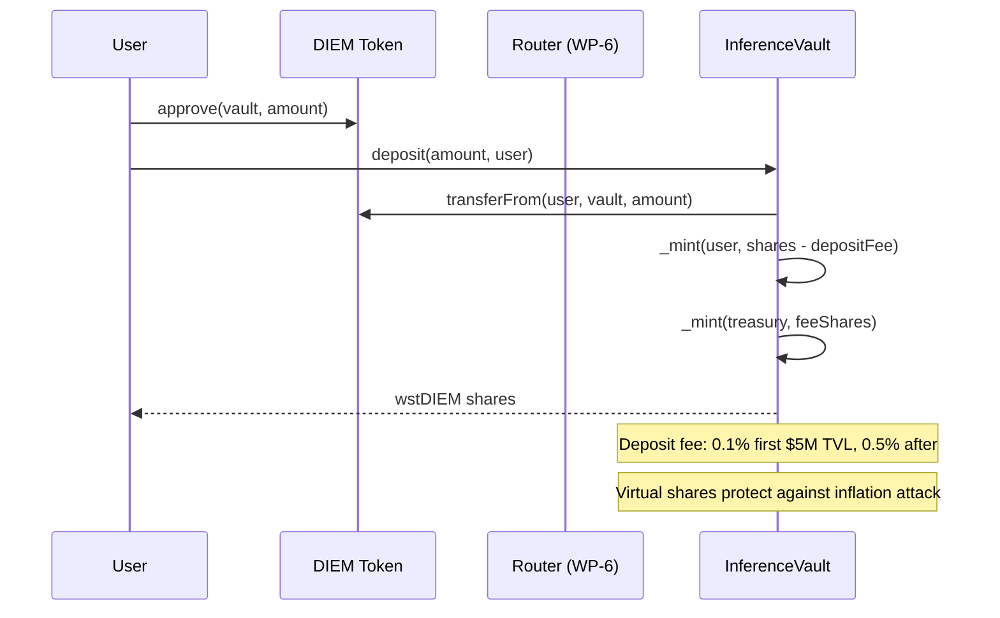
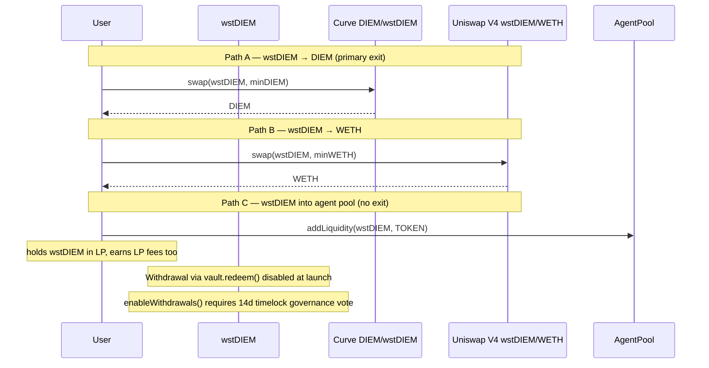
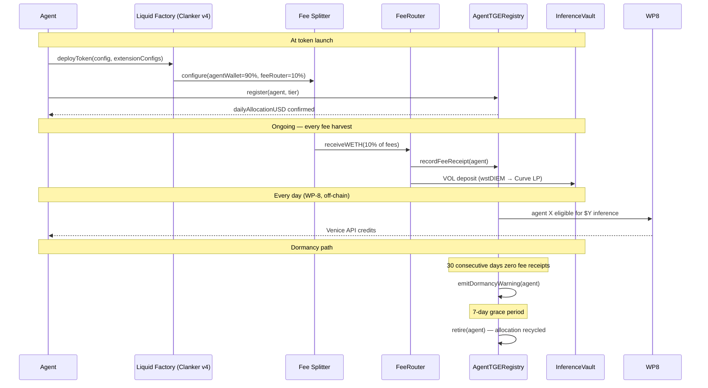
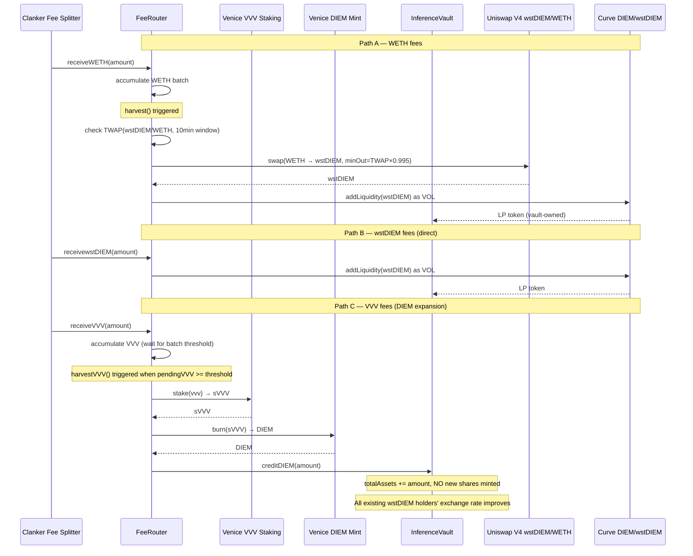
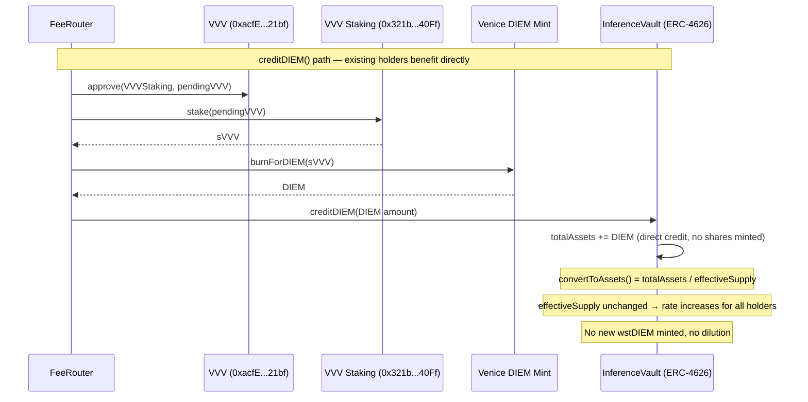
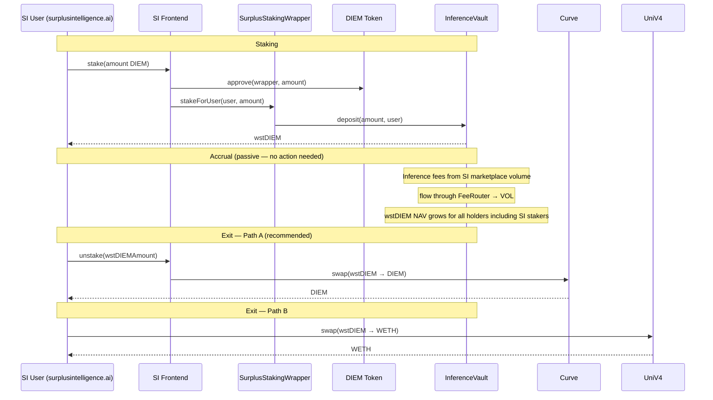
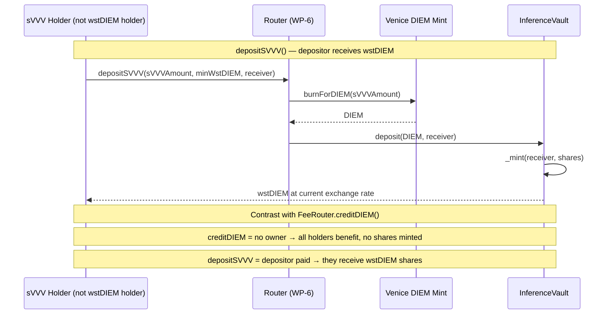
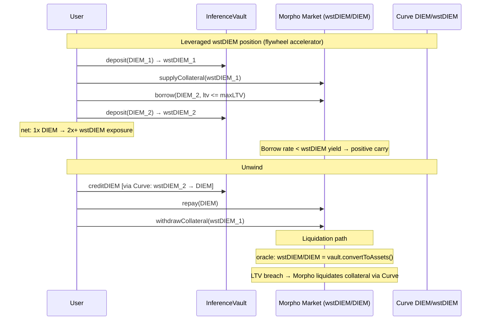

# Liquid Inference Vault — Architecture Specification

**Token:** `wstDIEM` (Wrapped Staked DIEM)  
**Chain:** Base mainnet (chain ID 8453)  
**Status:** Pre-implementation — WP-1 spec  
**Last updated:** 2026-05-21

---

## 1. What wstDIEM Is

wstDIEM is a yield-bearing ERC-4626 vault share representing a perpetual position in the inference economy. Holders earn from people paying to consume inference — they are on the yield side, not the consumption side.

**Four compounding mechanisms:**

| # | Mechanism | Flow |
|---|-----------|------|
| 1 | Agent fee allocations | Agents commit % of ongoing fees → FeeRouter → VOL |
| 2 | SI staking inflows | Surplus Intelligence users stake DIEM → wstDIEM; SI inference volume routes fees back |
| 3 | Metapool LP fees | Vault-owned Curve + Uniswap V4 positions earn swap fees on every entry/exit |
| 4 | VVV→DIEM expansion | FeeRouter converts VVV → sVVV → burns sVVV → mints DIEM → `creditDIEM()` on vault |

Mechanisms 1–3 grow VOL (vault-owned liquidity). Mechanism 4 expands the vault's DIEM asset base directly via `creditDIEM()`, which increases `totalAssets` without minting new shares — existing holders' exchange rate improves immediately.

**Exit options for wstDIEM holders:**
1. Sell wstDIEM → DIEM via Curve stableswap (primary exit, no approval needed)
2. Swap into an agent denominated in wstDIEM
3. Sell to WETH via Uniswap V4 pool
4. Hold and accumulate yield from metapool fee streams

---

## 2. System Components

```
┌─────────────────────────────────────────────────────────────────────┐
│                        wstDIEM Vault (ERC-4626)                     │
│  asset: DIEM  │  share: wstDIEM  │  withdrawals: disabled at launch │
│  creditDIEM() │  VOL accumulates │  recursive accounting             │
└──────────┬──────────────────────────────┬───────────────────────────┘
           │ deposit/withdraw              │ owns LP positions
    ┌──────┴──────┐                ┌──────┴───────────────────────┐
    │  Depositors │                │   Vault-Owned Liquidity (VOL) │
    │  (DIEM in,  │                │  Curve DIEM/wstDIEM (WP-4)   │
    │  wstDIEM out│                │  Uniswap V4 wstDIEM/WETH     │
    └─────────────┘                └──────────────────────────────┘
                                          ▲ LP fees
┌─────────────────────────────────────────┼────────────────────────────┐
│                     FeeRouter (WP-3)     │                            │
│  WETH path → swap → wstDIEM → VOL       │                            │
│  wstDIEM path → VOL directly            │                            │
│  VVV path → stake → sVVV → burn →       │                            │
│             DIEM → vault.creditDIEM()   │                            │
└─────────┬───────────────────────────────┘                            │
          │ 10% fee stream                                              │
    ┌─────┴──────────────────────────────────────────────┐             │
    │               Agent Pool (Clanker v4)               │             │
    │  TOKEN/DIEM or TOKEN/wstDIEM or TOKEN/WETH          │             │
    └─────────────────────────────────────────────────────┘             │
                                                                        │
┌───────────────────────────────────────────────────────────────────────┘
│   Surplus Intelligence (surplusintelligence.ai)
│   SI users → stake DIEM → wstDIEM (via SI frontend)
│   SI inference fees → FeeRouter → VOL
└──────────────────────────────────────────────────────────────────────

┌──────────────────────────────────────────────────────────────────────┐
│   Morpho Lending Market (WP-13) — flywheel accelerator               │
│   wstDIEM as collateral → borrow DIEM → loop or liquidity            │
└──────────────────────────────────────────────────────────────────────
```

---

## 3. Contract Interfaces

### 3.1 InferenceVault (ERC-4626)

```solidity
interface IInferenceVault is IERC4626 {
    // ERC-4626 overrides
    function maxWithdraw(address owner) external view returns (uint256); // returns 0 when !withdrawalsEnabled
    function maxRedeem(address owner) external view returns (uint256);   // returns 0 when !withdrawalsEnabled

    // DIEM expansion (non-dilutive — increases totalAssets without minting shares)
    function creditDIEM(uint256 amount) external;  // callable by FeeRouter only

    // Governance
    function enableWithdrawals() external;   // timelocked 14d via TimelockController
    function setDepositFee(uint256 bps) external; // governance only
    function setBurnEnabled(bool enabled) external; // governance only, off by default

    // Views
    function withdrawalsEnabled() external view returns (bool);
    function depositFeeBps() external view returns (uint256);
    function vaultOwnedShares() external view returns (uint256); // for recursive accounting
    function convertToAssets(uint256 shares) external view returns (uint256);
    // NOTE: totalSupply used in convertToAssets excludes vaultOwnedShares()
}
```

### 3.2 FeeRouter

```solidity
interface IFeeRouter {
    // Entry points (all three denominations accepted)
    function receiveWETH(uint256 amount) external;
    function receivewstDIEM(uint256 amount) external;
    function receiveVVV(uint256 amount) external;

    // Harvest (permissionless, gas-incentivized)
    function harvest() external;      // routes WETH and wstDIEM batches
    function harvestVVV() external;   // VVV batch: stake → sVVV → burn → creditDIEM

    // Config (governance only)
    function setMaxSlippageBps(uint256 bps) external;
    function setVVVBatchThreshold(uint256 amount) external;
    function setMinPoolLiquidity(uint256 minWstDIEMWei) external;
    function setMarketBuyVVVEnabled(bool enabled) external; // off by default

    // Views
    function pendingVVV() external view returns (uint256);
    function pendingWETH() external view returns (uint256);
}
```

### 3.3 AgentTGERegistry (WP-7)

```solidity
interface IAgentTGERegistry {
    struct Commitment {
        address agent;
        uint256 dailyAllocationUSD; // $X in 6-decimal fixed point
        uint8   tier;               // 0=Bronze,1=Silver,2=Gold
        uint256 lastFeeReceiptAt;   // timestamp
        bool    active;
    }

    function register(address agent, uint8 tier) external;
    function terminate() external;                      // voluntary exit
    function markDormant(address agent) external;       // after 30d no fees
    function recordFeeReceipt(address agent) external;  // called by FeeRouter on receipt

    function getCommitment(address agent) external view returns (Commitment memory);
    function isEligible(address agent) external view returns (bool);
    function totalCommittedUSD() external view returns (uint256);
}
```

### 3.3b Router — sVVV Entry Path (WP-6)

```solidity
interface IRouter {
    // Standard paths
    function depositWETH(uint256 wethAmount, uint256 minWstDIEM, address receiver) external returns (uint256);
    function exitToWETH(uint256 wstDIEMAmount, uint256 minWETH, address receiver) external returns (uint256);

    // sVVV entry — for outside sVVV holders who want wstDIEM exposure
    // Burns sVVV → DIEM → vault.deposit() → wstDIEM to receiver
    // The depositor receives wstDIEM shares (they paid; this is NOT creditDIEM)
    function depositSVVV(uint256 sVVVAmount, uint256 minWstDIEM, address receiver) external returns (uint256 shares);

    // VVV entry (stakes first, then burns)
    function depositVVV(uint256 vvvAmount, uint256 minWstDIEM, address receiver) external returns (uint256 shares);
}
```

**Key distinction:**
- `depositSVVV()` / `depositVVV()` — outside holder converts Venice assets to wstDIEM; they receive wstDIEM shares at current exchange rate. Same as any other deposit.
- `FeeRouter.creditDIEM()` — "house money" from accumulated fee VVV; no owner, benefits all existing holders. No new shares minted.

### 3.4 SurplusStakingWrapper (WP-9, optional)

```solidity
interface ISurplusStakingWrapper {
    // Thin wrapper over vault.deposit() for SI frontend integration
    function stakeForUser(address user, uint256 diemAmount) external returns (uint256 wstDIEM);
    function unstakeForUser(address user, uint256 wstDIEMAmount) external; // routes to Curve exit
    function referralDeposit(address user, uint256 diemAmount, bytes32 ref) external returns (uint256);

    function getBalance(address user) external view returns (uint256 wstDIEM);
    function getYield(address user) external view returns (uint256 accruedDIEM); // estimated
}
```

---

## 4. Sequence Diagrams

### 4.1 Deposit Flow — DIEM → wstDIEM



### 4.2 Exit Flows



### 4.3 Agent TGE Commitment Flow



### 4.4 Fee Routing Flow — All Three Paths



### 4.5 VVV → DIEM Expansion — Non-Dilutive Mechanism



### 4.6 Surplus Intelligence Staking Flow



### 4.6b sVVV Deposit Path — Outside sVVV Holder



### 4.7 Morpho Leveraged Position (WP-13)



---

## 5. Deployment Topology

```
Base Mainnet
│
├── Venice Protocol
│   ├── DIEM token:            0xF4d97F2da56e8c3098f3a8D538DB630A2606a024
│   ├── VVV token:             0xacfE6019Ed1A7Dc6f7B508C02d1b04ec88cC21bf
│   ├── VVV staking (→sVVV):  0x321b7ff75154472B18EDb199033fF4D116F340Ff
│   └── DIEM mint contract:   `0x321b7ff75154472B18EDb199033fF4D116F340Ff` (VVV staking contract — `mintDiem(sVVVAmount, 0)` mints to caller, returns void)
│
├── Liquid Protocol (this repo)
│   ├── InferenceVault.sol          [WP-2]  DIEM asset, wstDIEM share
│   ├── FeeRouter.sol               [WP-3]  WETH/wstDIEM/VVV → VOL or creditDIEM
│   ├── Curve DIEM/wstDIEM pool     [WP-4]  A=300, fee=0.3%, MA=600s
│   ├── Uniswap V4 wstDIEM/WETH    [WP-5]  dynamic fee hook
│   ├── Router.sol                  [WP-6]  WETH↔wstDIEM convenience wrapper
│   ├── AgentTGERegistry.sol        [WP-7]  TGE commitments, tier registry
│   ├── InferenceAccounting         [WP-8]  off-chain ledger + on-chain settlement
│   ├── SurplusStakingWrapper.sol   [WP-9]  SI frontend integration
│   ├── TimelockController          [WP-10] 14d timelock for vault params
│   ├── Safe multisig               [WP-10] 3-of-5 governance (D-7 default)
│   ├── MorphoMarket (wstDIEM/DIEM) [WP-13] LLTV=77% at launch → 86% post-audit; oracle=convertToAssets()
│   └── Monitoring (Dune + alerts)  [WP-11]
│
└── Surplus Intelligence
    └── surplusintelligence.ai      frontend → SurplusStakingWrapper
```

---

## 6. Key Invariants

| Invariant | Description |
|-----------|-------------|
| `maxWithdraw() == 0` | When `withdrawalsEnabled == false`, ERC-4626 compliance |
| `convertToAssets` monotone | Exchange rate never decreases (VOL only adds, never removes) |
| Burn OFF | `burnEnabled == false` at deploy; governance-gated enable |
| No new shares on `creditDIEM` | VVV expansion path must not mint wstDIEM shares |
| VOL excluded from supply | `convertToAssets` denominator excludes vault-owned wstDIEM |
| TWAP slippage guard | FeeRouter WETH swap rejects if spot deviates >0.5% from 10min TWAP |
| VVV batch minimum | `harvestVVV()` no-ops until `pendingVVV >= batchThreshold` |
| Dormancy = 30 days | AgentTGERegistry dormancy clock resets on any fee receipt ≥ 1e15 |

---

## 7. Open Decisions

| ID | Decision | Blocks | Default |
|----|----------|--------|---------|
| D-7 | Multisig composition | WP-10 final | 3-of-5 |
| D-9 | Venice DIEM delegation (no-delegation constraint) | WP-8 inference delivery | Off-chain ledger |
| D-10 | VVV accumulation source | WP-3 VVV path | Direct deposits only (no market-buy) |

## 8. Resolved Decisions

| ID | Decision | Resolution |
|----|----------|------------|
| D-1 | Inference accounting architecture | Off-chain ledger + on-chain settlement |
| D-2 | Surplus Intelligence contract shape | We provide staking for SI; SI is distribution layer |
| D-3 | $X pricing mechanism | Fixed tiers Bronze/Silver/Gold (values TBD with @gordie) |
| D-8 | Curve off-peg multiplier | 8x default |

---

## 9. Critical Path

```
WP-1 (this spec)
  └── WP-2 (vault)
        ├── WP-4 (Curve pool) ──┐
        ├── WP-5 (Uniswap V4)   ├── WP-3 (FeeRouter) ── WP-7 (TGE registry) ── WP-8 (inference)
        ├── WP-10 (governance)   │                                                     │
        └── WP-9 (SI staking) ──┘                                                     │
                                                                                       │
  WP-13 (Morpho) ── parallel after WP-2 ────────────────────────────────────────────  │
  WP-6 (Router)  ── parallel after WP-4/5                                             │
  WP-11 (monitoring) ── after WP-2/3/4/5                                              │
  WP-12 (launch)  ── final ────────────────────────────────────────────────────────────
```
